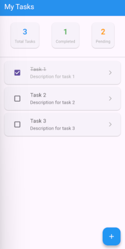
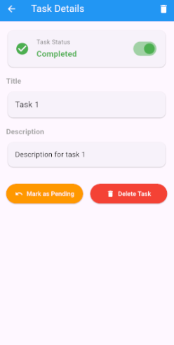
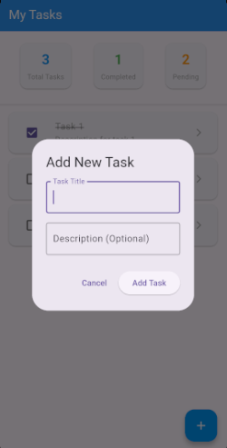
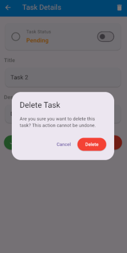

# Flutter Todo App with GetX

A simple and elegant Todo application built with Flutter and GetX state management. This app demonstrates proper implementation of GetX patterns including state management, dependency injection, and navigation.

## 📱 Features

- ✅ Add Tasks: Create new tasks with title and description
- ✅ View Tasks: Display tasks with completion status
- ✅ Toggle Status: Mark tasks as complete/incomplete
- ✅ Task Details: View full task information
- ✅ Delete Tasks: Remove tasks with confirmation
- ✅ Real-time Stats: Track total, completed, and pending tasks
- ✅ Responsive UI: Clean Material Design interface

## 🚀 Screenshots
[Add screenshots here]

| Task List Screen | Task Details Screen | Add Task Dialog | Delete Task Dialog |
|------------------|---------------------|-----------------|--------------------|
|  |  |  |  |

## 🛠️ Technologies Used

- Flutter - UI Framework
- GetX - State Management, Dependency Injection, and Navigation
- Dart - Programming Language
- Material Design - UI Components

## 📋 GetX Features Demonstrated

### State Management
- GetxController for business logic
- RxList for reactive data
- Obx() for automatic UI updates

### Dependency Injection
- Bindings for controller registration
- Get.lazyPut() for memory-efficient injection
- Get.find() for controller access

### Navigation
- Get.toNamed() for route navigation
- Get.back() for returning to previous screen
- Get.arguments for passing data between screens

### UI Management
- Get.dialog() for showing dialogs
- Get.snackbar() for user notifications

## 📁 Project Structure

```
todo_app
├── assets/app_icon.png
├── lib/
    ├── main.dart   # App entry point
    ├── app.dart    # Material App
    |
    ├── models/
    │       └── task_model.dart   # Task data model
    |
    ├── controllers/
    │       └── task_controller.dart  # Business logic & state management
    |
    ├── views/
    │       ├── task_list_screen.dart     # Main screen with task list
    │       └── task_details_screen.dart  # Task details and editing
    |
    ├── widgets/
    │       ├── task_tile.dart # Individual task display
    │       └── add_task_dialog.dart # Add new task form
    |
    ├── bindings/
    │       └── task_binding.dart # Dependency injection setup
    |
    └── routes/
            └── app_routes.dart # Route constants

```

## 🔧 Installation & Setup

### Prerequisites
- Flutter SDK (>=3.0.0)
- Dart SDK (>=2.17.0)
- Android Studio / VS Code
- Android/iOS Emulator or Physical Device

### Clone Repository
```bash
git clone https://github.com/yourusername/flutter-todo-getx.git
cd flutter-todo-getx
```

### Install Dependencies
```
flutter pub get
``

### Run the App
```
flutter run
```

## 📦 Dependencies

```
dependencies:
  flutter:
    sdk: flutter
  get: ^4.7.2

dev_dependencies:
  flutter_test:
    sdk: flutter
  flutter_lints: ^5.0.0
  flutter_launcher_icons: ^0.14.4

flutter_launcher_icons:
  android: true
  ios: false
  image_path: assets/app_icon.png

flutter:
  uses-material-design: true
  assets:
    - assets/app_icon.png
``

## 🏗️ Architecture Overview

### Model-View-Controller (MVC) Pattern
- Models: Data structures (Task)
- Views: UI screens and widgets
- Controllers: Business logic (TaskController)

### GetX Reactive Programming
```
// Observable Data
final RxList<Task> tasks = <Task>[].obs;

// Reactive UI
Obx(() => Text('${controller.tasks.length} tasks'))

// Automatic Updates
tasks.add(newTask); // UI updates automatically
```

### Dependency Injection Flow
1. TaskBinding registers TaskController
2. GetMaterialApp uses initialBinding
3. Screens access controller with Get.find()
4. Same instance shared across app


## 🎯 Core Concepts Explained

### Task Model
```
class Task {
  final String id;
  final String title;
  final String description;
  bool isDone;
}
```

### Controller Pattern
```
class TaskController extends GetxController {
  final RxList<Task> tasks = <Task>[].obs;
  
  void addTask(String title, String description) {
    // Business logic here
    tasks.add(newTask); // Automatic UI update
  }
}
```

### Navigation Pattern
```
// Navigate with data
Get.toNamed('/task-details', arguments: taskId);

// Receive data
final taskId = Get.arguments as String;

// Return to previous screen
Get.back();
```

## 🚀 Building for Production
Android APK [Download here]()
```
flutter build apk --release
``

## 🔄 App Flow

### Development Flow
1. Models → Define data structure
2. Controllers → Implement business logic
3. Bindings → Setup dependency injection
4. Routes → Define navigation
5. Widgets → Create reusable components
6. Screens → Build main interfaces
7. Main → Wire everything together

### User Flow
1. App Launch → View task list (empty state)
2. Add Task → Tap FAB → Fill form → Task appears
3. View Details → Tap task → See full information
4. Toggle Status → Use checkbox or switch
5. Delete Task → Confirmation dialog → Task removed